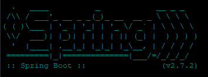

    

<h1 align="center" class="Título-e-Imagem-de-capa"> PROJETO SPRING MVC E SPRING SECURITY </h1>

___

    
    
    
    
    
    
    
    
    
    
    
    

## Índice 

* [Título e Imagem de capa](#Título-e-Imagem-de-capa)
* [Badges](#badges)
* [Índice](#índice)
* [Descrição do Projeto](#descrição-do-projeto)
* [TECNOLOGIAS](#tecnologias)
* [Status do Projeto](#status-do-Projeto)
* [Funcionalidades e Demonstração da Aplicação](#funcionalidades-e-demonstração-da-aplicação)
* [Acesso ao Projeto](#acesso-ao-projeto)
* [Tecnologias utilizadas](#tecnologias-utilizadas)
* [Pessoas Contribuidoras e Desenvolvedoras](#pessoas-contribuidoras-e-desenvolvedoras)
* [Licença](#licença)

## DESCRIÇÃO DO PROJETO

Este projeto tem como objetivo demostra minhas habilidades usando so SPRING com MVC e SPRING SECURITY
Neste projeto será criando um sistema de LOGIN e LOGOUT onde somente usuário que estão devidamente cadastrados no banco de dados com login e senha Criptografada com Bcrypte poderão acessar determinadas ROTAS.
Porém a rota principal está liberada para o acesso ao todos usuários.
Neste aplicado tem como objetivos usuários que desejam comprar produtos de outros paises que não são vendidos no seu pais.
Porém a transação é realizada entre usuários, um usuário X localiza determinado produto online que possue desejo, então cadastrar alguns dados principais do produto, como url do site, url da foto do produto, o nome do produto etc. O usuário Y vive em outro pais e poderá fazer uma oferta para comprar o produto, o mesmo informa o valor que ficará o produto com a entrega e e envia para o usuário X que caso aceite poderá aguardar até o produto ser recebido.

## TECNOLOGIAS

Este projeto ultiliza em sua composição o SPRING com JPA para se conectar ao banco de dados e salvar informações dos produtos, as class são criadas com anotações e gerados metodos CRUD do JPA com SPRING usando Repository e Services para acoplar o código com regras de organização do SOLID.

O projeto também ultiliza SPRING SECURITY que será responsável pelo sistema de login e logout.

### SPRING

Este projeto ultilza tecnolocia SPRING para gerar os formulários com o modelo MVC

    

### SPRING MVC

NO Spring MVC o sistema pega as rotas informada no controller e renderiza os HTML no templates.

    

### SPRING MVC

o sistema utiliza técnicas modernas do Spring Security para gerar os usuário que podem logar e quais rotas podem ser acessado.

    

    

### SPRING REST 

Esta aplicação também ultiliza o modelo REST controller para facilitar a renderização cliente side no sistema.

    

### BOOTSTRAP

Para estilização da página, organização de elementos, botões, formulário foram aplicados técnicas do framework BOOTSTRAP

    

### THYMELEAF 

A rederização do HTML usa o tHYMELEAF para pegar os dados do backEnd e rederizar dados no front-end.

    

### VUES

O formulário para "ofertas" foi realizado com VUES, buscando dados no back-end com API REST.

    

## Status do Projeto

> :construction: Projeto em construção :construction: 

## Funcionalidades e Demonstração da Aplicação

### LOGIN

    

O usuário precisa primeiramente está logado para acessar as rotas, a única rota que será visivel para usuário será a rota "/home".

### home

A rota home é a única que está liberado acesso para todos, nesta página só retorna os pedidos que já foram entregues para os usuários.

    

### Após login

Após logar o usuário é direcionado para rota "meus pedidos", nessa rota ele pode consultar os pedidos que ele mesmo cadastrou.

    

Na rota do meu pedido o usuário poderá filtrar os pedidos por status como Entregues, Aguardando, aprovados ou todos.
    Obs: Os pedidos retornam somente 4 por pesquisa para evitar grande número de requisições por página. E possue o metodo Cache para filtrar que as requisições será somente por requisições da página.

    

    

### Formulário

O formulário é uma rota privada que somente o usuário poderá usar, nesta rota solicita dados sobre o produto, como nome, descrição, url do produto, e url da imagem do produto.

    

O forumulário possui campos que são obritórios serem preenchidos e caso nãos seja o usuário terá retorno do erro abaixo.

    

### FAZER UMA oferta

O usuário poderá fazer ofertas para outros usuários, na rota "fazer uma oferta" o usuário será direcionado a lista com todos os pedidos de outros usuários, nela o usuário poderá fazer uma oferta para comprar o pedido e enviar para o usuário, nesta parte o usuário poderá preencher valor do pedido, comentários e data para entregar o pedido.

    

Este formulário retorna erros caso a data ou valores não estejam no formato correto.

    

## Acesso ao Projeto

Para testar o projeto basta baixar o mesmo e instalar com MARVEM e então com projeto instalado localize em SRC RESOURCES dentro da pasta teria o arquivo properties, edite os dados do de conexão do SQL conforme sua conexão, e crie as tablas MUDI ou outras conforme decidir.
Lembre de rodar no SQL os comandos para criar usuários.

    

## Tecnologias utilizadas

### SPRING MVC
### SPRING SEGURITY
### JDBC e JPA
### MySQL
### MAVEM
### thymeleaf
### VUES

## Pessoas Contribuidoras e Desenvolvedoras do Projeto

CRIADO COM :heart: POR KAI WANG!

## Licença